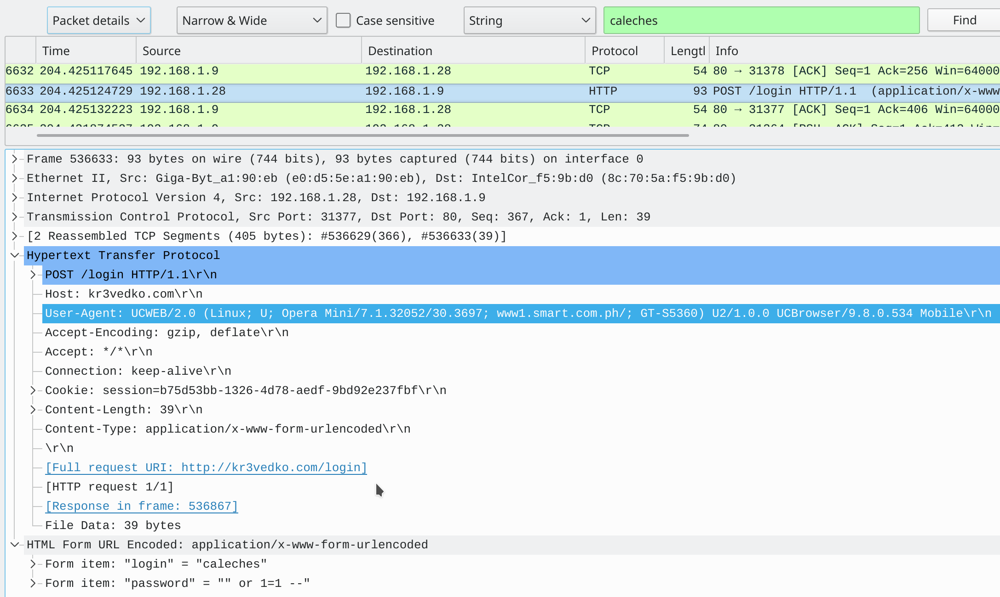
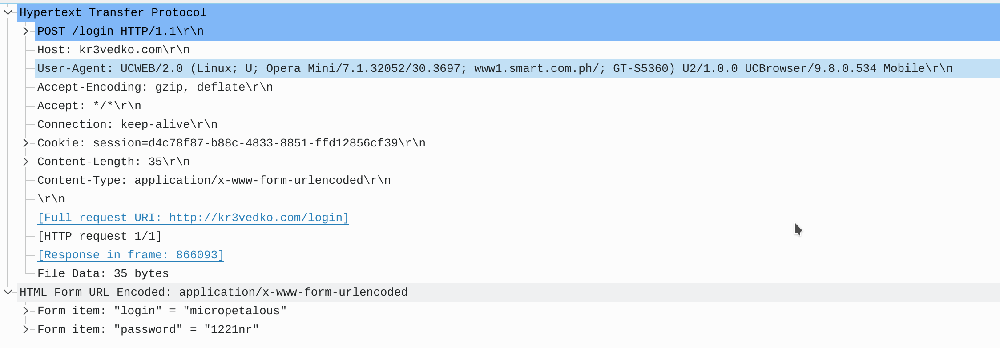

# CyBRICS 2020 Krevedka 
by klanec

Category: Forensics 
Difficulty: Easy 
Points: 50
> Author: Artur Khanov (@awengar)
>
>Some user of our service hacked another user.
>
>Name of the victim user was 'caleches'. But we don't know the real login of the attacker. Help us find it!

We receive a large packet capture showing a lot of users interacting with a web service.

## The Solution
First, examine all login attempts from the user 'caleches' by searching the packets in wireshark until we identify the malicious log in

Notice the SQL injection in the password field. It is highly likely that this is the user who hacked into calecheses account. If we search for the user agent, we find another user logging in with an identical one:

flag:

`cybrics{micropetalous}`