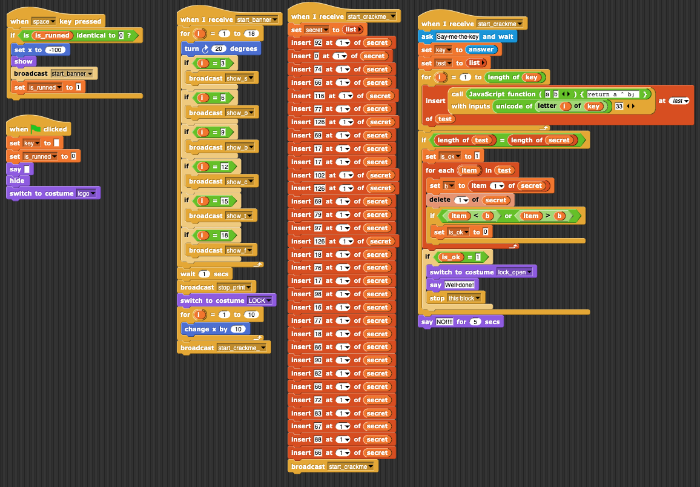
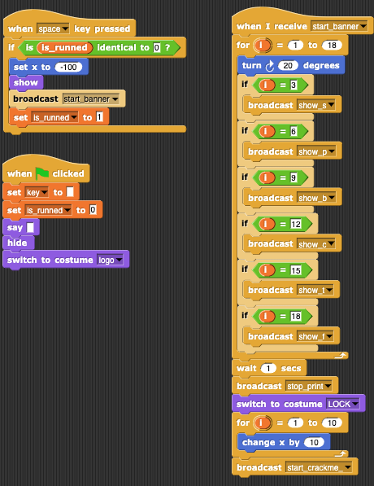
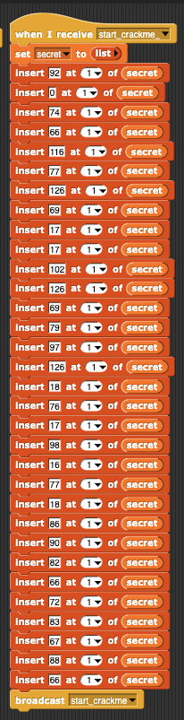
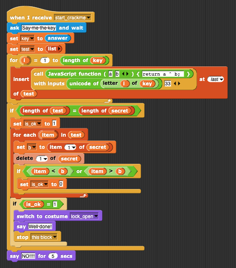

# CyBRICS 2020 Baby Rev Keyshooter Writeup
by qpwoeirut

Category: Reverse 
Difficulty: Baby 
Points: 50
> Author: Egor Zaytsev (@groke)
>
> I started teaching my daugther some reversing. She is capable to solve this crackme. Are you?
>
> Download: babyrev.tar.gz
>
> This link can be helpful: snap.berkeley.edu/offline

We get a program written in some block language.
It takes an input and tells us if it's the secret or not.

## TL;DR
XOR cipher with key = 33

## Explanation
We can use the provided link to get the visual version of the program.

All the program does is xor each character by 33.
It has 5 different parts.

On the left we have some stuff that just initializes the program and its graphics.

This just starts the program and waits until the user presses space to execute.

Then we have another block which is initializing `secret` by inserting numbers at the start (and lists are 1-indexed since this is a kids' language).

We can copy over this list into a python program manually.

This just leaves the encryption itself.

The bottom half is checking for equality between `test` and `secret` and then doing some graphics, so let's ignore that.
We see a `call JavaScript function(a, b) {return a ^ b;}`, which is called with each character of our input and 33.
From here it's easy to write a quick Python program and xor by 33 again.

Implementation at `solve_babyrev.py`.

`cybrics{w3l1C0m3_@nd_G00d_lUck!}`